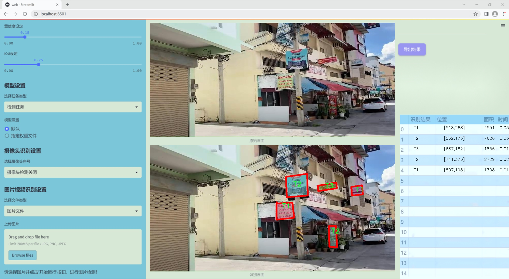
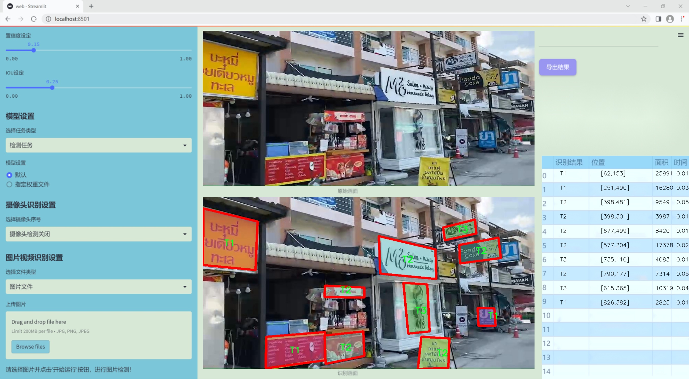
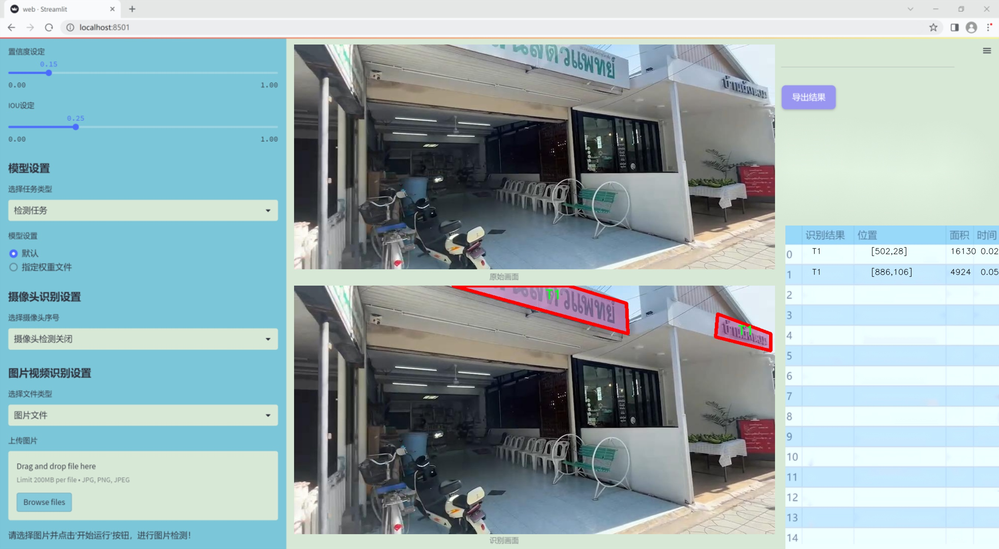
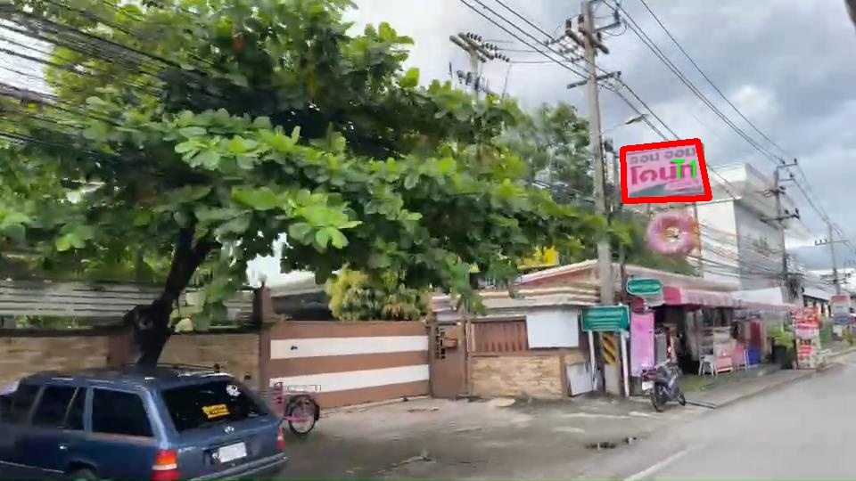

### 1.背景意义

研究背景与意义

随着城市化进程的加快，路边广告牌作为重要的商业宣传媒介，越来越多地出现在城市的各个角落。它们不仅承担着信息传播的功能，还对城市的视觉环境产生了深远的影响。然而，随着广告牌数量的激增，如何有效地管理和分析这些广告牌，成为了城市管理者和广告商面临的一大挑战。传统的人工监测和管理方式效率低下，难以满足日益增长的需求。因此，开发一种基于计算机视觉的自动化实例分割系统，能够精准识别和分析路边广告牌，显得尤为重要。

本研究旨在基于改进的YOLOv11模型，构建一个高效的路边广告牌实例分割系统。YOLO（You Only Look Once）系列模型因其实时性和高精度而广泛应用于目标检测领域。通过对YOLOv11进行改进，我们期望在提高检测精度的同时，提升模型对复杂场景的适应能力。为此，我们将利用一个包含2100张图像的多类别数据集，该数据集包含三类广告牌（T1、T2、T3），并已进行YOLO格式的标注。这一数据集的构建为模型的训练和验证提供了坚实的基础。

此外，实例分割技术的应用将使得广告牌的边界更加清晰，能够有效区分不同类别的广告牌，从而为后续的分析和决策提供更为准确的数据支持。通过对广告牌的自动识别与分类，城市管理者可以实时掌握广告牌的分布情况，优化广告资源的配置，提升城市的整体形象。同时，广告商也能借助这一系统，分析广告牌的投放效果，制定更为精准的市场策略。

综上所述，基于改进YOLOv11的路边广告牌实例分割系统，不仅具有重要的学术价值，还有着广泛的应用前景，能够为城市管理和商业决策提供有力支持。

### 2.视频效果

[2.1 视频效果](https://www.bilibili.com/video/BV1mSk1YsEtS/)

### 3.图片效果







##### [项目涉及的源码数据来源链接](https://kdocs.cn/l/cszuIiCKVNis)**

注意：本项目提供训练的数据集和训练教程,由于版本持续更新,暂不提供权重文件（best.pt）,请按照6.训练教程进行训练后实现上图演示的效果。

### 4.数据集信息

##### 4.1 本项目数据集类别数＆类别名

nc: 3
names: ['T1', 'T2', 'T3']


该项目为【图像分割】数据集，请在【训练教程和Web端加载模型教程（第三步）】这一步的时候按照【图像分割】部分的教程来训练

##### 4.2 本项目数据集信息介绍

本项目数据集信息介绍

本项目旨在改进YOLOv11的路边广告牌实例分割系统，所使用的数据集专注于“Sign”主题，涵盖了与路边广告牌相关的多种实例。该数据集包含三种主要类别，分别为T1、T2和T3，这些类别代表了不同类型的广告牌和标识，能够有效地为模型的训练提供多样化的样本。这种多样性不仅有助于提高模型的泛化能力，还能增强其在实际应用中的表现。

在数据集的构建过程中，我们注重了样本的多样性和代表性，确保涵盖了各种不同的环境和光照条件下的广告牌实例。这些实例包括城市街道、乡村道路以及商业区等多种场景，力求在训练过程中模拟真实世界中的各种情况。此外，为了提高数据集的实用性，我们还进行了数据增强处理，包括旋转、缩放、裁剪等操作，以生成更多的训练样本，从而提升模型的鲁棒性。

数据集的标注工作也经过严格的审核，确保每个实例的类别标注准确无误。通过精确的标注，模型能够更好地学习到不同类别广告牌的特征，从而在实例分割任务中实现更高的准确率和召回率。我们相信，凭借这一高质量的数据集，改进后的YOLOv11模型将在路边广告牌的检测和分割任务中展现出卓越的性能，为智能交通和城市管理等领域提供有力的技术支持。





### 5.全套项目环境部署视频教程（零基础手把手教学）

[5.1 所需软件PyCharm和Anaconda安装教程（第一步）](https://www.bilibili.com/video/BV1BoC1YCEKi/?spm_id_from=333.999.0.0&vd_source=bc9aec86d164b67a7004b996143742dc)


[5.2 安装Python虚拟环境创建和依赖库安装视频教程（第二步）](https://www.bilibili.com/video/BV1ZoC1YCEBw?spm_id_from=333.788.videopod.sections&vd_source=bc9aec86d164b67a7004b996143742dc)

### 6.改进YOLOv11训练教程和Web_UI前端加载模型教程（零基础手把手教学）

[6.1 改进YOLOv11训练教程和Web_UI前端加载模型教程（第三步）](https://www.bilibili.com/video/BV1BoC1YCEhR?spm_id_from=333.788.videopod.sections&vd_source=bc9aec86d164b67a7004b996143742dc)


按照上面的训练视频教程链接加载项目提供的数据集，运行train.py即可开始训练



     Epoch   gpu_mem       box       obj       cls    labels  img_size
     1/200     20.8G   0.01576   0.01955  0.007536        22      1280: 100%|██████████| 849/849 [14:42<00:00,  1.04s/it]
               Class     Images     Labels          P          R     mAP@.5 mAP@.5:.95: 100%|██████████| 213/213 [01:14<00:00,  2.87it/s]
                 all       3395      17314      0.994      0.957      0.0957      0.0843

     Epoch   gpu_mem       box       obj       cls    labels  img_size
     2/200     20.8G   0.01578   0.01923  0.007006        22      1280: 100%|██████████| 849/849 [14:44<00:00,  1.04s/it]
               Class     Images     Labels          P          R     mAP@.5 mAP@.5:.95: 100%|██████████| 213/213 [01:12<00:00,  2.95it/s]
                 all       3395      17314      0.996      0.956      0.0957      0.0845

     Epoch   gpu_mem       box       obj       cls    labels  img_size
     3/200     20.8G   0.01561    0.0191  0.006895        27      1280: 100%|██████████| 849/849 [10:56<00:00,  1.29it/s]
               Class     Images     Labels          P          R     mAP@.5 mAP@.5:.95: 100%|███████   | 187/213 [00:52<00:00,  4.04it/s]
                 all       3395      17314      0.996      0.957      0.0957      0.0845


###### [项目数据集下载链接](https://kdocs.cn/l/cszuIiCKVNis)

### 7.原始YOLOv11算法讲解

##### YOLO11简介

> YOLO11源码地址：https://github.com/ultralytics/ultralytics

Ultralytics
YOLO11是一款尖端的、最先进的模型，它在之前YOLO版本成功的基础上进行了构建，并引入了新功能和改进，以进一步提升性能和灵活性。YOLO11设计快速、准确且易于使用，使其成为各种物体检测和跟踪、实例分割、图像分类以及姿态估计任务的绝佳选择。  


**YOLO11创新点如下:**

YOLO 11主要改进包括：  
`增强的特征提取`：YOLO 11采用了改进的骨干和颈部架构，增强了特征提取功能，以实现更精确的目标检测。  
`优化的效率和速度`：优化的架构设计和优化的训练管道提供更快的处理速度，同时保持准确性和性能之间的平衡。  
`更高的精度，更少的参数`：YOLO11m在COCO数据集上实现了更高的平均精度（mAP），参数比YOLOv8m少22%，使其在不影响精度的情况下提高了计算效率。  
`跨环境的适应性`：YOLO 11可以部署在各种环境中，包括边缘设备、云平台和支持NVIDIA GPU的系统。  
`广泛的支持任务`：YOLO 11支持各种计算机视觉任务，如对象检测、实例分割、图像分类、姿态估计和面向对象检测（OBB）。

**YOLO11不同模型尺寸信息：**

YOLO11 提供5种不同的型号规模模型，以满足不同的应用需求：

Model| size (pixels)| mAPval 50-95| Speed CPU ONNX (ms)| Speed T4 TensorRT10
(ms)| params (M)| FLOPs (B)  
---|---|---|---|---|---|---  
YOLO11n| 640| 39.5| 56.1 ± 0.8| 1.5 ± 0.0| 2.6| 6.5  
YOLO11s| 640| 47.0| 90.0 ± 1.2| 2.5 ± 0.0| 9.4| 21.5  
YOLO11m| 640| 51.5| 183.2 ± 2.0| 4.7 ± 0.1| 20.1| 68.0  
YOLO11l| 640| 53.4| 238.6 ± 1.4| 6.2 ± 0.1| 25.3| 86.9  
YOLO11x| 640| 54.7| 462.8 ± 6.7| 11.3 ± 0.2| 56.9| 194.9  
  
**模型常用训练超参数参数说明：**  
`YOLOv11
模型的训练设置包括训练过程中使用的各种超参数和配置`。这些设置会影响模型的性能、速度和准确性。关键的训练设置包括批量大小、学习率、动量和权重衰减。此外，优化器、损失函数和训练数据集组成的选择也会影响训练过程。对这些设置进行仔细的调整和实验对于优化性能至关重要。  
**以下是一些常用的模型训练参数和说明：**

参数名| 默认值| 说明  
---|---|---  
`model`| `None`| 指定用于训练的模型文件。接受指向 `.pt` 预训练模型或 `.yaml`
配置文件。对于定义模型结构或初始化权重至关重要。  
`data`| `None`| 数据集配置文件的路径（例如
`coco8.yaml`).该文件包含特定于数据集的参数，包括训练数据和验证数据的路径、类名和类数。  
`epochs`| `100`| 训练总轮数。每个epoch代表对整个数据集进行一次完整的训练。调整该值会影响训练时间和模型性能。  
`patience`| `100`| 在验证指标没有改善的情况下，提前停止训练所需的epoch数。当性能趋于平稳时停止训练，有助于防止过度拟合。  
`batch`| `16`| 批量大小，有三种模式:设置为整数(例如，’ Batch =16 ‘)， 60% GPU内存利用率的自动模式(’ Batch
=-1 ‘)，或指定利用率分数的自动模式(’ Batch =0.70 ')。  
`imgsz`| `640`| 用于训练的目标图像尺寸。所有图像在输入模型前都会被调整到这一尺寸。影响模型精度和计算复杂度。  
`device`| `None`| 指定用于训练的计算设备：单个 GPU (`device=0`）、多个 GPU (`device=0,1`)、CPU
(`device=cpu`)，或苹果芯片的 MPS (`device=mps`).  
`workers`| `8`| 加载数据的工作线程数（每 `RANK` 多 GPU 训练）。影响数据预处理和输入模型的速度，尤其适用于多 GPU 设置。  
`name`| `None`| 训练运行的名称。用于在项目文件夹内创建一个子目录，用于存储训练日志和输出结果。  
`pretrained`| `True`| 决定是否从预处理模型开始训练。可以是布尔值，也可以是加载权重的特定模型的字符串路径。提高训练效率和模型性能。  
`optimizer`| `'auto'`| 为训练模型选择优化器。选项包括 `SGD`, `Adam`, `AdamW`, `NAdam`,
`RAdam`, `RMSProp` 等，或 `auto` 用于根据模型配置进行自动选择。影响收敛速度和稳定性  
`lr0`| `0.01`| 初始学习率（即 `SGD=1E-2`, `Adam=1E-3`) .调整这个值对优化过程至关重要，会影响模型权重的更新速度。  
`lrf`| `0.01`| 最终学习率占初始学习率的百分比 = (`lr0 * lrf`)，与调度程序结合使用，随着时间的推移调整学习率。  


**各损失函数作用说明：**  
`定位损失box_loss`：预测框与标定框之间的误差（GIoU），越小定位得越准；  
`分类损失cls_loss`：计算锚框与对应的标定分类是否正确，越小分类得越准；  
`动态特征损失（dfl_loss）`：DFLLoss是一种用于回归预测框与目标框之间距离的损失函数。在计算损失时，目标框需要缩放到特征图尺度，即除以相应的stride，并与预测的边界框计算Ciou
Loss，同时与预测的anchors中心点到各边的距离计算回归DFLLoss。  


### 8.200+种全套改进YOLOV11创新点原理讲解

#### 8.1 200+种全套改进YOLOV11创新点原理讲解大全

由于篇幅限制，每个创新点的具体原理讲解就不全部展开，具体见下列网址中的改进模块对应项目的技术原理博客网址【Blog】（创新点均为模块化搭建，原理适配YOLOv5~YOLOv11等各种版本）

[改进模块技术原理博客【Blog】网址链接](https://gitee.com/qunmasj/good)


#### 8.2 精选部分改进YOLOV11创新点原理讲解

###### 这里节选部分改进创新点展开原理讲解(完整的改进原理见上图和[改进模块技术原理博客链接](https://gitee.com/qunmasj/good)【如果此小节的图加载失败可以通过CSDN或者Github搜索该博客的标题访问原始博客，原始博客图片显示正常】

### RT-DETR骨干网络HGNetv2简介
#### RT-DETR横空出世
前几天被百度的RT-DETR刷屏，参考该博客提出的目标检测新范式对原始DETR的网络结构进行了调整和优化，以提高计算速度和减小模型大小。这包括使用更轻量级的基础网络和调整Transformer结构。并且，摒弃了nms处理的detr结构与传统的物体检测方法相比，不仅训练是端到端的，检测也能端到端，这意味着整个网络在训练过程中一起进行优化，推理过程不需要昂贵的后处理代价，这有助于提高模型的泛化能力和性能。


当然，人们对RT-DETR之所以产生浓厚的兴趣，我觉得大概率还是对YOLO系列审美疲劳了，就算是出到了YOLO10086，我还是只想用YOLOv11和YOLOv11的框架来魔改做业务。。

#### 初识HGNet
看到RT-DETR的性能指标，发现指标最好的两个模型backbone都是用的HGNetv2，毫无疑问，和当时的picodet一样，骨干都是使用百度自家的网络。初识HGNet的时候，当时是参加了第四届百度网盘图像处理大赛，文档图像方向识别专题赛道，简单来说，就是使用分类网络对一些文档截图或者图片进行方向角度分类。


当时的方案并没有那么快定型，通常是打榜过程发现哪个网络性能好就使用哪个网络做魔改，而且木有显卡，只能蹭Ai Studio的平台，不过v100一天8小时的实验时间有点短，这也注定了大模型用不了。 

流水的模型，铁打的炼丹人，最后发现HGNet-tiny各方面指标都很符合我们的预期，后面就一直围绕它魔改。当然，比赛打榜是目的，学习才是享受过程，当时看到效果还可以，便开始折腾起了HGNet的网络架构，我们可以看到，PP-HGNet 针对 GPU 设备，对目前 GPU 友好的网络做了分析和归纳，尽可能多的使用 3x3 标准卷积（计算密度最高），PP-HGNet是由多个HG-Block组成，细节如下：


ConvBNAct是啥？简单聊一聊，就是Conv+BN+Act，CV Man应该最熟悉不过了：
```python
class ConvBNAct(TheseusLayer):
    def __init__(self,
                 in_channels,
                 out_channels,
                 kernel_size,
                 stride,
                 groups=1,
                 use_act=True):
        super().__init__()
        self.use_act = use_act
        self.conv = Conv2D(
            in_channels,
            out_channels,
            kernel_size,
            stride,
            padding=(kernel_size - 1) // 2,
            groups=groups,
            bias_attr=False)
        self.bn = BatchNorm2D(
            out_channels,
            weight_attr=ParamAttr(regularizer=L2Decay(0.0)),
            bias_attr=ParamAttr(regularizer=L2Decay(0.0)))
        if self.use_act:
            self.act = ReLU()
 
    def forward(self, x):
        x = self.conv(x)
        x = self.bn(x)
        if self.use_act:
            x = self.act(x)
        return x 
```
且标准卷积的数量随层数深度增加而增多，从而得到一个有利于 GPU 推理的骨干网络，同样速度下，精度也超越其他 CNN ，性价比也优于ViT-base模型。


另外，我们可以看到：

PP-HGNet 的第一层由channel为96的Stem模块构成，目的是为了减少参数量和计算量。PP-HGNet

Tiny的整体结构由四个HG Stage构成，而每个HG Stage主要由包含大量标准卷积的HG Block构成。

PP-HGNet的第三到第五层使用了使用了可学习的下采样层（LDS Layer），该层group为输入通道数，可达到降参降计算量的作用，且Tiny模型仅包含三个LDS Layer，并不会对GPU的利用率造成较大影响.

PP-HGNet的激活函数为Relu，常数级操作可保证该模型在硬件上的推理速度。

### 9.系统功能展示

图9.1.系统支持检测结果表格显示

  图9.2.系统支持置信度和IOU阈值手动调节

  图9.3.系统支持自定义加载权重文件best.pt(需要你通过步骤5中训练获得)

  图9.4.系统支持摄像头实时识别

  图9.5.系统支持图片识别

  图9.6.系统支持视频识别

  图9.7.系统支持识别结果文件自动保存

  图9.8.系统支持Excel导出检测结果数据


### 10. YOLOv11核心改进源码讲解

#### 10.1 deconv.py

以下是对代码中最核心部分的提取和详细注释：

```python
import math
import torch
from torch import nn
from einops.layers.torch import Rearrange

# 定义一个带有自定义权重获取方法的二维卷积层
class Conv2d_cd(nn.Module):
    def __init__(self, in_channels, out_channels, kernel_size=3, stride=1,
                 padding=1, dilation=1, groups=1, bias=False, theta=1.0):
        super(Conv2d_cd, self).__init__()
        # 初始化标准的二维卷积层
        self.conv = nn.Conv2d(in_channels, out_channels, kernel_size=kernel_size, stride=stride, padding=padding, dilation=dilation, groups=groups, bias=bias)
        self.theta = theta  # 自定义参数

    def get_weight(self):
        # 获取卷积层的权重
        conv_weight = self.conv.weight
        conv_shape = conv_weight.shape
        # 重排权重的形状
        conv_weight = Rearrange('c_in c_out k1 k2 -> c_in c_out (k1 k2)')(conv_weight)
        
        # 创建一个新的权重张量
        conv_weight_cd = torch.zeros(conv_shape[0], conv_shape[1], 3 * 3, device=conv_weight.device, dtype=conv_weight.dtype)
        conv_weight_cd[:, :, :] = conv_weight[:, :, :]
        # 调整权重
        conv_weight_cd[:, :, 4] = conv_weight[:, :, 4] - conv_weight[:, :, :].sum(2)
        # 恢复权重的形状
        conv_weight_cd = Rearrange('c_in c_out (k1 k2) -> c_in c_out k1 k2', k1=conv_shape[2], k2=conv_shape[3])(conv_weight_cd)
        return conv_weight_cd, self.conv.bias  # 返回调整后的权重和偏置


# 定义一个具有不同权重调整方式的卷积层
class DEConv(nn.Module):
    def __init__(self, dim):
        super(DEConv, self).__init__()
        # 初始化多个自定义卷积层
        self.conv1_1 = Conv2d_cd(dim, dim, 3, bias=True)
        self.conv1_2 = Conv2d_hd(dim, dim, 3, bias=True)
        self.conv1_3 = Conv2d_vd(dim, dim, 3, bias=True)
        self.conv1_4 = Conv2d_ad(dim, dim, 3, bias=True)
        self.conv1_5 = nn.Conv2d(dim, dim, 3, padding=1, bias=True)
        
        self.bn = nn.BatchNorm2d(dim)  # 批归一化层
        self.act = nn.ReLU()  # 激活函数

    def forward(self, x):
        # 前向传播
        if hasattr(self, 'conv1_1'):
            # 获取所有卷积层的权重和偏置
            w1, b1 = self.conv1_1.get_weight()
            w2, b2 = self.conv1_2.get_weight()
            w3, b3 = self.conv1_3.get_weight()
            w4, b4 = self.conv1_4.get_weight()
            w5, b5 = self.conv1_5.weight, self.conv1_5.bias

            # 合并所有卷积层的权重和偏置
            w = w1 + w2 + w3 + w4 + w5
            b = b1 + b2 + b3 + b4 + b5
            # 使用合并后的权重进行卷积操作
            res = nn.functional.conv2d(input=x, weight=w, bias=b, stride=1, padding=1, groups=1)
        else:
            res = self.conv1_5(x)  # 如果没有自定义卷积层，直接使用最后一个卷积层
            
        if hasattr(self, 'bn'):
            res = self.bn(res)  # 应用批归一化
        
        return self.act(res)  # 返回激活后的结果
    
    def switch_to_deploy(self):
        # 切换到部署模式，合并卷积层的权重和偏置
        w1, b1 = self.conv1_1.get_weight()
        w2, b2 = self.conv1_2.get_weight()
        w3, b3 = self.conv1_3.get_weight()
        w4, b4 = self.conv1_4.get_weight()
        w5, b5 = self.conv1_5.weight, self.conv1_5.bias

        # 合并权重和偏置
        self.conv1_5.weight = torch.nn.Parameter(w1 + w2 + w3 + w4 + w5)
        self.conv1_5.bias = torch.nn.Parameter(b1 + b2 + b3 + b4 + b5)
        
        # 删除不再需要的卷积层
        del self.conv1_1
        del self.conv1_2
        del self.conv1_3
        del self.conv1_4

# 主程序部分
if __name__ == '__main__':
    data = torch.randn((1, 128, 64, 64)).cuda()  # 创建随机输入数据
    model = DEConv(128).cuda()  # 初始化模型
    output1 = model(data)  # 前向传播得到输出
    model.switch_to_deploy()  # 切换到部署模式
    output2 = model(data)  # 再次前向传播得到输出
    print(torch.allclose(output1, output2))  # 检查两个输出是否相同
```

### 代码核心部分说明：
1. **卷积层定义**：`Conv2d_cd` 和 `DEConv` 是核心类，分别定义了自定义卷积层和一个包含多个卷积层的复合卷积模块。
2. **权重获取与调整**：`get_weight` 方法用于获取和调整卷积层的权重，确保在不同情况下的卷积操作能够正常进行。
3. **前向传播**：`forward` 方法实现了数据的前向传播，结合多个卷积层的输出。
4. **部署模式切换**：`switch_to_deploy` 方法用于在模型部署时合并卷积层的权重和偏置，优化模型的推理效率。

这些核心部分构成了一个复杂的卷积神经网络模块，能够根据不同的输入和参数进行灵活的卷积操作。

这个文件 `deconv.py` 定义了一个深度学习模型的模块，主要是用于卷积操作的自定义实现。代码中包含多个类，每个类实现了不同类型的卷积操作，最后通过 `DEConv` 类将这些卷积组合在一起。以下是对代码的逐步分析和说明。

首先，文件导入了一些必要的库，包括 `math`、`torch` 和 `torch.nn`，以及 `einops` 库中的 `Rearrange`，用于重排张量的维度。接着，导入了自定义的 `Conv` 模块和 `fuse_conv_and_bn` 函数。

接下来定义了多个卷积类，每个类都继承自 `nn.Module`，并实现了特定的卷积操作。

1. **Conv2d_cd** 类：这是一个自定义的二维卷积层，构造函数中初始化了标准的 `nn.Conv2d` 卷积层，并定义了一个 `theta` 参数。`get_weight` 方法用于获取卷积权重，并对其进行重排和调整，以适应特定的卷积需求。

2. **Conv2d_ad** 类：与 `Conv2d_cd` 类似，但在 `get_weight` 方法中对权重进行了不同的调整，具体是通过对权重进行变换来实现自适应卷积。

3. **Conv2d_rd** 类：实现了一个带有条件判断的卷积层。在 `forward` 方法中，如果 `theta` 接近于零，则直接使用标准卷积；否则，计算调整后的卷积权重并进行卷积操作。

4. **Conv2d_hd** 和 **Conv2d_vd** 类：这两个类实现了一维卷积，主要用于特定的卷积权重调整，分别在 `get_weight` 方法中对权重进行了不同的重排和调整。

最后，**DEConv** 类将上述卷积层组合在一起。它在构造函数中初始化了多个卷积层，并在 `forward` 方法中将它们的输出相加，形成最终的卷积结果。`switch_to_deploy` 方法用于将模型切换到部署模式，合并卷积层的权重和偏置，以提高推理效率。

在 `__main__` 部分，创建了一个随机输入数据并实例化了 `DEConv` 模型，随后进行前向传播并输出结果。最后，调用 `switch_to_deploy` 方法后再次进行前向传播，并检查两个输出是否相等。

总体来看，这个文件实现了一个复杂的卷积神经网络模块，利用自定义的卷积层和权重调整方法来增强模型的灵活性和适应性。

#### 10.2 test_selective_scan_easy.py

以下是代码中最核心的部分，并附上详细的中文注释：

```python
import torch
import torch.nn.functional as F

def selective_scan_easy(us, dts, As, Bs, Cs, Ds, delta_bias=None, delta_softplus=False, return_last_state=False, chunksize=64):
    """
    选择性扫描函数
    参数:
    us: 输入张量，形状为 (B, G * D, L)
    dts: 时间增量张量，形状为 (B, G * D, L)
    As: 权重矩阵，形状为 (G * D, N)
    Bs: 权重矩阵，形状为 (B, G, N, L)
    Cs: 权重矩阵，形状为 (B, G, N, L)
    Ds: 可选的偏置项，形状为 (G * D)
    delta_bias: 可选的偏置增量，形状为 (G * D)
    delta_softplus: 是否对 dts 应用 softplus
    return_last_state: 是否返回最后的状态
    chunksize: 每次处理的序列长度
    """
    
    def selective_scan_chunk(us, dts, As, Bs, Cs, hprefix):
        """
        处理单个块的选择性扫描
        参数:
        us: 输入张量，形状为 (L, B, G, D)
        dts: 时间增量张量，形状为 (L, B, G, D)
        As: 权重矩阵，形状为 (G, D, N)
        Bs: 权重矩阵，形状为 (L, B, G, N)
        Cs: 权重矩阵，形状为 (B, G, N, L)
        hprefix: 前一个状态，形状为 (B, G, D, N)
        返回:
        ys: 输出张量，形状为 (L, B, G, D)
        hs: 状态张量，形状为 (L, B, G, D)
        """
        ts = dts.cumsum(dim=0)  # 计算时间增量的累积和
        Ats = torch.einsum("gdn,lbgd->lbgdn", As, ts).exp()  # 计算 A 的指数
        scale = 1  # 缩放因子
        rAts = Ats / scale  # 归一化
        duts = dts * us  # 计算 duts
        dtBus = torch.einsum("lbgd,lbgn->lbgdn", duts, Bs)  # 计算 dtBus
        hs_tmp = rAts * (dtBus / rAts).cumsum(dim=0)  # 计算状态
        hs = hs_tmp + Ats * hprefix.unsqueeze(0)  # 更新状态
        ys = torch.einsum("lbgn,lbgdn->lbgd", Cs, hs)  # 计算输出
        return ys, hs

    # 数据类型设置
    dtype = torch.float32
    inp_dtype = us.dtype  # 输入数据类型
    has_D = Ds is not None  # 检查 Ds 是否存在
    if chunksize < 1:
        chunksize = Bs.shape[-1]  # 设置块大小

    # 数据预处理
    dts = dts.to(dtype)
    if delta_bias is not None:
        dts = dts + delta_bias.view(1, -1, 1).to(dtype)  # 应用偏置
    if delta_softplus:
        dts = F.softplus(dts)  # 应用 softplus

    # 处理 Bs 和 Cs 的维度
    if len(Bs.shape) == 3:
        Bs = Bs.unsqueeze(1)
    if len(Cs.shape) == 3:
        Cs = Cs.unsqueeze(1)

    # 维度重排
    B, G, N, L = Bs.shape
    us = us.view(B, G, -1, L).permute(3, 0, 1, 2).to(dtype)
    dts = dts.view(B, G, -1, L).permute(3, 0, 1, 2).to(dtype)
    As = As.view(G, -1, N).to(dtype)
    Bs = Bs.permute(3, 0, 1, 2).to(dtype)
    Cs = Cs.permute(3, 0, 1, 2).to(dtype)
    Ds = Ds.view(G, -1).to(dtype) if has_D else None
    D = As.shape[1]  # 状态维度

    oys = []  # 输出列表
    hprefix = us.new_zeros((B, G, D, N), dtype=dtype)  # 初始化前一个状态
    for i in range(0, L, chunksize):
        ys, hs = selective_scan_chunk(
            us[i:i + chunksize], dts[i:i + chunksize], 
            As, Bs[i:i + chunksize], Cs[i:i + chunksize], hprefix, 
        )
        oys.append(ys)  # 收集输出
        hprefix = hs[-1]  # 更新前一个状态

    oys = torch.cat(oys, dim=0)  # 合并输出
    if has_D:
        oys = oys + Ds * us  # 应用偏置
    oys = oys.permute(1, 2, 3, 0).view(B, -1, L)  # 重排输出

    return oys.to(inp_dtype) if not return_last_state else (oys.to(inp_dtype), hprefix.view(B, G * D, N).float())
```

### 代码核心部分说明：
1. **selective_scan_easy**: 这是主要的选择性扫描函数，负责处理输入数据并返回输出。它通过调用内部的 `selective_scan_chunk` 函数来处理数据块。
2. **selective_scan_chunk**: 该函数处理每个数据块的计算，包括时间增量的累积和、状态更新以及输出的计算。
3. **数据预处理**: 包括数据类型转换、偏置应用和维度重排，以确保输入数据符合计算要求。
4. **输出收集**: 在循环中收集每个块的输出，并在最后合并所有输出。

以上代码实现了选择性扫描的核心逻辑，适用于处理时间序列数据的场景。

这个程序文件 `test_selective_scan_easy.py` 是一个用于实现和测试选择性扫描（Selective Scan）算法的 Python 脚本，主要使用了 PyTorch 库。该文件包含了选择性扫描的前向和反向传播的实现，以及一系列的测试用例。

程序首先导入了一些必要的库，包括 `math`、`torch`、`torch.nn.functional`、`pytest` 和 `einops`。接着定义了一个名为 `selective_scan_easy` 的函数，该函数实现了选择性扫描的核心逻辑。函数的输入包括多个张量，分别表示输入数据、时间差、权重矩阵等。函数内部使用了一个嵌套的 `selective_scan_chunk` 函数来处理数据块，利用张量运算来实现选择性扫描的计算。

选择性扫描的计算过程涉及到多个步骤，包括对输入数据的累加、权重的计算和状态的更新。具体来说，函数通过对输入的时间差进行累加，计算出权重矩阵，并利用这些权重对输入数据进行加权求和，最终输出结果。

接下来，定义了一个 `SelectiveScanEasy` 类，该类继承自 `torch.autograd.Function`，用于实现自定义的前向和反向传播。类中的 `forward` 方法实现了选择性扫描的前向传播逻辑，而 `backward` 方法则实现了反向传播，计算梯度。反向传播的实现较为复杂，涉及到多个中间变量的计算和梯度的累加。

在文件的后半部分，定义了一些用于测试的函数和参数。使用 `pytest` 框架来进行单元测试，测试函数 `test_selective_scan` 中定义了多个参数化的测试用例，以验证选择性扫描的实现是否正确。测试用例中包括对输入数据的不同形状、类型和状态的设置，并对输出结果进行比较，确保实现的正确性。

最后，文件提供了一个命令行入口，可以直接运行测试用例。整体来看，这个程序文件实现了选择性扫描算法的前向和反向传播，并通过一系列测试用例验证了其正确性，适合用于深度学习模型中的序列数据处理。

#### 10.3 mamba_yolo.py

以下是保留的核心代码部分，并附上详细的中文注释：

```python
import torch
import torch.nn as nn
from einops import rearrange

class LayerNorm2d(nn.Module):
    """自定义的二维层归一化模块"""
    
    def __init__(self, normalized_shape, eps=1e-6, elementwise_affine=True):
        super().__init__()
        # 使用 PyTorch 的 LayerNorm 进行归一化
        self.norm = nn.LayerNorm(normalized_shape, eps, elementwise_affine)

    def forward(self, x):
        # 将输入的形状从 (B, C, H, W) 转换为 (B, H, W, C)
        x = rearrange(x, 'b c h w -> b h w c').contiguous()
        # 进行归一化
        x = self.norm(x)
        # 将形状转换回 (B, C, H, W)
        x = rearrange(x, 'b h w c -> b c h w').contiguous()
        return x


class CrossScan(torch.autograd.Function):
    """交叉扫描操作的自定义函数"""
    
    @staticmethod
    def forward(ctx, x: torch.Tensor):
        B, C, H, W = x.shape
        ctx.shape = (B, C, H, W)
        # 创建一个新的张量，用于存储交叉扫描的结果
        xs = x.new_empty((B, 4, C, H * W))
        # 第一部分：直接展平
        xs[:, 0] = x.flatten(2, 3)
        # 第二部分：转置后展平
        xs[:, 1] = x.transpose(dim0=2, dim1=3).flatten(2, 3)
        # 第三和第四部分：翻转前两部分
        xs[:, 2:4] = torch.flip(xs[:, 0:2], dims=[-1])
        return xs

    @staticmethod
    def backward(ctx, ys: torch.Tensor):
        B, C, H, W = ctx.shape
        L = H * W
        # 反向传播时，合并计算梯度
        ys = ys[:, 0:2] + ys[:, 2:4].flip(dims=[-1]).view(B, 2, -1, L)
        y = ys[:, 0] + ys[:, 1].view(B, -1, W, H).transpose(dim0=2, dim1=3).contiguous().view(B, -1, L)
        return y.view(B, -1, H, W)


class SS2D(nn.Module):
    """自定义的二维选择性扫描模块"""
    
    def __init__(self, d_model=96, d_state=16, ssm_ratio=2.0, dropout=0.0):
        super().__init__()
        self.in_proj = nn.Conv2d(d_model, d_model * ssm_ratio, kernel_size=1)  # 输入投影
        self.out_proj = nn.Conv2d(d_model * ssm_ratio, d_model, kernel_size=1)  # 输出投影
        self.dropout = nn.Dropout(dropout)  # Dropout 层

    def forward(self, x: torch.Tensor):
        x = self.in_proj(x)  # 进行输入投影
        # 这里可以插入选择性扫描的逻辑
        x = self.dropout(x)  # 应用 Dropout
        x = self.out_proj(x)  # 进行输出投影
        return x


class VSSBlock_YOLO(nn.Module):
    """YOLO中的自定义块"""
    
    def __init__(self, in_channels: int, hidden_dim: int, drop_path: float = 0):
        super().__init__()
        self.proj_conv = nn.Conv2d(in_channels, hidden_dim, kernel_size=1)  # 投影卷积
        self.ss2d = SS2D(d_model=hidden_dim)  # 选择性扫描模块
        self.drop_path = nn.Dropout(drop_path)  # DropPath 层

    def forward(self, input: torch.Tensor):
        input = self.proj_conv(input)  # 进行投影
        x = self.ss2d(input)  # 进行选择性扫描
        x = self.drop_path(x)  # 应用 DropPath
        return x
```

### 代码注释说明：
1. **LayerNorm2d**: 自定义的二维层归一化模块，主要用于对输入的特征图进行归一化处理，以提高模型的训练稳定性。
2. **CrossScan**: 自定义的交叉扫描操作，包含前向和反向传播的实现。前向传播中对输入进行展平和转置操作，反向传播中计算梯度。
3. **SS2D**: 自定义的二维选择性扫描模块，包含输入和输出的卷积投影，以及 Dropout 层，用于防止过拟合。
4. **VSSBlock_YOLO**: YOLO网络中的自定义块，包含输入的投影卷积和选择性扫描模块的组合，最后应用 DropPath。

这些核心部分是实现选择性扫描和特征处理的基础，能够有效地进行特征提取和信息融合。

这个程序文件 `mamba_yolo.py` 实现了一个基于深度学习的模型，主要用于计算机视觉任务，特别是目标检测。文件中包含多个类和函数，主要功能是构建一个复杂的神经网络架构。以下是对代码的详细说明。

首先，导入了一些必要的库，包括 `torch` 和 `torch.nn`，这些是构建深度学习模型的基础库。还使用了 `einops` 库来进行张量的重排和重复操作，以及 `timm` 库中的 `DropPath` 层用于实现随机深度的特性。

接下来，定义了一个 `LayerNorm2d` 类，这是一个二维层归一化的实现，适用于图像数据。它通过调整输入的维度顺序来应用 `LayerNorm`，确保在通道维度上进行归一化。

`autopad` 函数用于自动计算卷积操作的填充，以确保输出的形状与输入相同，方便后续的层连接。

接下来定义了几个重要的自定义操作，包括 `CrossScan` 和 `CrossMerge`，它们实现了特定的张量操作，主要用于在网络中进行信息的交叉扫描和合并。这些操作通过 PyTorch 的自定义 autograd 功能实现，能够在前向和反向传播中高效计算。

`SelectiveScanCore` 类实现了选择性扫描的核心功能，允许在特定条件下对输入进行选择性处理。这个类的前向和反向方法都使用了 CUDA 加速，以提高计算效率。

`cross_selective_scan` 函数是一个高层次的接口，结合了前面定义的操作，处理输入张量并应用选择性扫描，返回处理后的输出。

接下来是 `SS2D` 类，它实现了一个基于选择性扫描的二维神经网络模块。这个模块包括输入投影、卷积层、选择性扫描操作和输出投影。它的设计允许在不同的配置下灵活使用，支持多种前向传播方式。

`RGBlock` 和 `LSBlock` 类实现了特定的块结构，分别用于处理输入特征并进行非线性变换。它们通过卷积层和激活函数组合，形成深度学习中的基本构建块。

`XSSBlock` 和 `VSSBlock_YOLO` 类是更复杂的模块，结合了前面定义的所有组件，形成了一个完整的网络层。它们支持多种配置选项，允许用户根据需求调整模型的结构和参数。

`SimpleStem` 类是网络的起始部分，负责将输入图像转换为适合后续处理的特征表示。它通过一系列卷积和归一化层来实现。

最后，`VisionClueMerge` 类用于合并特征图，通常在多尺度特征融合的场景中使用。

整体来看，这个文件实现了一个复杂的深度学习模型，具有高度的模块化和灵活性，适合用于计算机视觉任务，尤其是目标检测。通过使用选择性扫描和自定义的张量操作，模型能够有效地处理输入数据并提取有用的特征。

#### 10.4 afpn.py

以下是经过简化和注释的核心代码部分，主要保留了模型的结构和关键功能。

```python
import torch
import torch.nn as nn
import torch.nn.functional as F
from ..modules.conv import Conv

# 定义基本的卷积块
class BasicBlock(nn.Module):
    def __init__(self, filter_in, filter_out):
        super(BasicBlock, self).__init__()
        # 两个卷积层
        self.conv1 = Conv(filter_in, filter_out, 3)
        self.conv2 = Conv(filter_out, filter_out, 3, act=False)

    def forward(self, x):
        residual = x  # 保存输入用于残差连接
        out = self.conv1(x)  # 第一个卷积
        out = self.conv2(out)  # 第二个卷积
        out += residual  # 残差连接
        return self.conv1.act(out)  # 返回激活后的输出

# 定义上采样模块
class Upsample(nn.Module):
    def __init__(self, in_channels, out_channels, scale_factor=2):
        super(Upsample, self).__init__()
        # 使用1x1卷积和双线性插值进行上采样
        self.upsample = nn.Sequential(
            Conv(in_channels, out_channels, 1),
            nn.Upsample(scale_factor=scale_factor, mode='bilinear')
        )

    def forward(self, x):
        return self.upsample(x)  # 执行上采样

# 定义下采样模块
class Downsample_x2(nn.Module):
    def __init__(self, in_channels, out_channels):
        super(Downsample_x2, self).__init__()
        # 使用2x2卷积进行下采样
        self.downsample = Conv(in_channels, out_channels, 2, 2, 0)

    def forward(self, x):
        return self.downsample(x)  # 执行下采样

# 自适应特征融合模块
class ASFF_2(nn.Module):
    def __init__(self, inter_dim=512):
        super(ASFF_2, self).__init__()
        compress_c = 8  # 压缩通道数
        # 定义权重卷积层
        self.weight_level_1 = Conv(inter_dim, compress_c, 1)
        self.weight_level_2 = Conv(inter_dim, compress_c, 1)
        self.weight_levels = nn.Conv2d(compress_c * 2, 2, kernel_size=1)  # 计算融合权重
        self.conv = Conv(inter_dim, inter_dim, 3)  # 最后的卷积层

    def forward(self, input1, input2):
        # 计算每个输入的权重
        level_1_weight_v = self.weight_level_1(input1)
        level_2_weight_v = self.weight_level_2(input2)
        levels_weight_v = torch.cat((level_1_weight_v, level_2_weight_v), 1)  # 拼接权重
        levels_weight = self.weight_levels(levels_weight_v)  # 计算最终权重
        levels_weight = F.softmax(levels_weight, dim=1)  # 归一化权重

        # 根据权重融合输入
        fused_out_reduced = input1 * levels_weight[:, 0:1, :, :] + input2 * levels_weight[:, 1:2, :, :]
        out = self.conv(fused_out_reduced)  # 最后的卷积
        return out

# 定义特征金字塔网络（FPN）模块
class AFPN_P345(nn.Module):
    def __init__(self, in_channels=[256, 512, 1024], out_channels=256, factor=4):
        super(AFPN_P345, self).__init__()
        # 输入通道的卷积层
        self.conv0 = Conv(in_channels[0], in_channels[0] // factor, 1)
        self.conv1 = Conv(in_channels[1], in_channels[1] // factor, 1)
        self.conv2 = Conv(in_channels[2], in_channels[2] // factor, 1)

        # 定义特征融合的主体
        self.body = BlockBody_P345([in_channels[0] // factor, in_channels[1] // factor, in_channels[2] // factor])

        # 输出通道的卷积层
        self.conv00 = Conv(in_channels[0] // factor, out_channels, 1)
        self.conv11 = Conv(in_channels[1] // factor, out_channels, 1)
        self.conv22 = Conv(in_channels[2] // factor, out_channels, 1)

    def forward(self, x):
        x0, x1, x2 = x  # 输入特征图
        x0 = self.conv0(x0)  # 卷积处理
        x1 = self.conv1(x1)
        x2 = self.conv2(x2)

        out0, out1, out2 = self.body([x0, x1, x2])  # 特征融合
        out0 = self.conv00(out0)  # 输出处理
        out1 = self.conv11(out1)
        out2 = self.conv22(out2)
        return [out0, out1, out2]  # 返回输出特征图
```

### 代码注释说明
1. **BasicBlock**: 定义了一个基本的卷积块，包含两个卷积层和残差连接。
2. **Upsample/Downsample**: 定义了上采样和下采样模块，分别使用卷积和插值方法调整特征图的尺寸。
3. **ASFF_2**: 自适应特征融合模块，通过计算输入特征的权重进行融合。
4. **AFPN_P345**: 特征金字塔网络的核心模块，处理输入特征图并输出融合后的特征图。

这些模块可以组合成更复杂的网络结构，适用于图像处理和计算机视觉任务。

这个程序文件`afpn.py`实现了一种特征金字塔网络（AFPN），用于计算机视觉任务中的特征提取和融合。该文件主要包含多个类，每个类实现了特定的功能，整体上构成了一个复杂的神经网络结构。

首先，文件引入了一些必要的库，包括`torch`和`torch.nn`，这些是PyTorch框架的核心模块，用于构建和训练神经网络。`OrderedDict`用于有序字典的操作，可能在某些模块中使用。

接下来，定义了多个类，其中`BasicBlock`类实现了一个基本的卷积块，包含两个卷积层和残差连接。`Upsample`和`Downsample_x2`等类用于实现上采样和下采样操作，分别通过卷积和插值方法调整特征图的尺寸。

`ASFF_2`、`ASFF_3`和`ASFF_4`类实现了自适应特征融合模块，能够根据输入特征图的权重进行加权融合。这些模块的设计允许网络在不同尺度上灵活地整合特征，从而提高特征表达能力。

`BlockBody_P345`和`BlockBody_P2345`类是网络的主体部分，分别处理不同数量的输入特征图。它们通过多层卷积块和自适应特征融合模块构建了一个深度网络结构。每个块都包含多个卷积层和下采样、上采样操作，以便在不同尺度上提取和融合特征。

`AFPN_P345`和`AFPN_P2345`类是特征金字塔网络的具体实现，分别接收3个和4个输入通道的特征图。它们通过初始化卷积层和主体块，将输入特征图进行处理，最终输出经过处理的特征图。`AFPN_P345_Custom`和`AFPN_P2345_Custom`类则允许用户自定义块的类型，以便在特定任务中使用不同的网络结构。

最后，文件中还包含了对卷积层和批归一化层的权重初始化，以确保网络在训练初期的稳定性和收敛速度。

总体而言，这个文件实现了一个灵活且强大的特征金字塔网络，适用于各种计算机视觉任务，如目标检测和图像分割等。通过不同的模块组合和自适应特征融合，网络能够有效地提取和利用多尺度特征信息。

### 11.完整训练+Web前端界面+200+种全套创新点源码、数据集获取


# [下载链接：https://mbd.pub/o/bread/Z5yckpht](https://mbd.pub/o/bread/Z5yckpht)